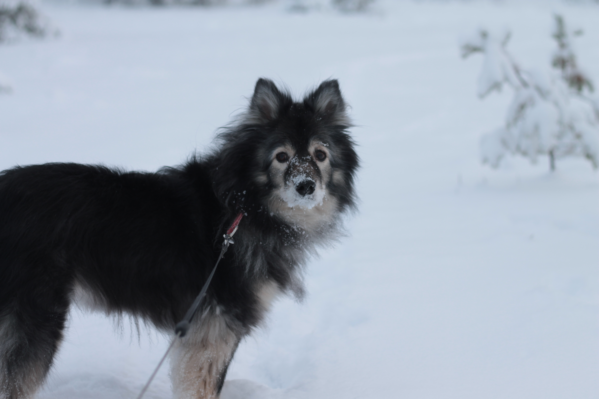

## Good day to you

Welcome to my Git Hub Pages- webpage. I made this page for Cloud services-course in Oulu University of Applied sciences. I have collected some photos and information of my dog.

# Muska the Dog

### Gender

Female (bitch) (womb is gone).

### Breed

75% Finnish lapphund, 25% Finnish spitz (as far as we know, that's what they told us).

### Age

14,5 years.

### Color

Black with light marks.

### Favorite things

* Running in the woods and yard
* Chewing (soft) bones, such as Dentasticks
* Back scratches

### How did she come to my life

Muska lived in Hiukkavaara, Oulu in 2009, when her previous owner needed a new home for her. She was then 9 months old. We got her for free, and got some accessories with her. I was 12 at the time. She as been like a wild child always, barking, running around and enjoying life. She still is, only difference is that she sleeps a lot more. In these 14 years, we have been on so many adventures in the nature. I grew up with her, and now that I am an adult, I will take care of her till the end of her days. Nowadays she's in good condition, going wild every time when it's time to go outside. Still, I know, that we do not have so much time left anymore. I'm trying to cherish every day that I get to spend with her. After all, she's my first own dog.

### More photos here

[Sleeping dog compilation](dogphotos.md)
